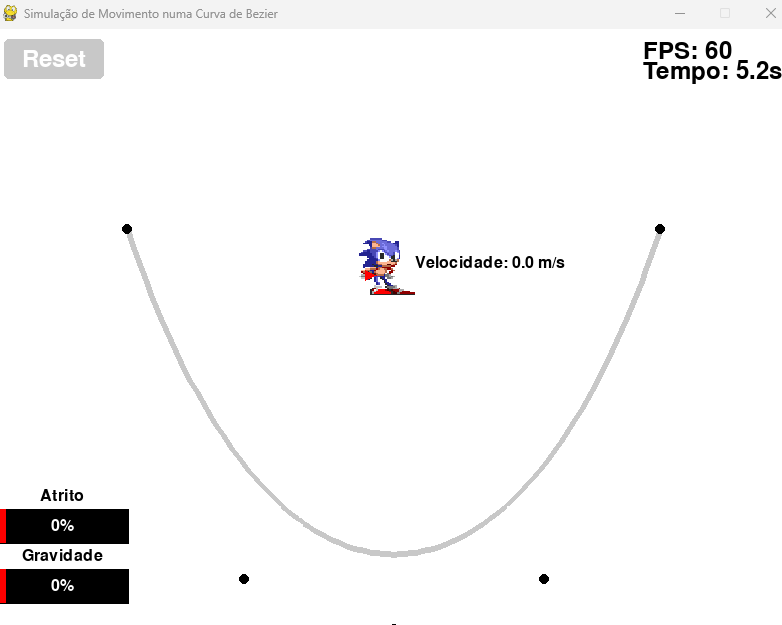
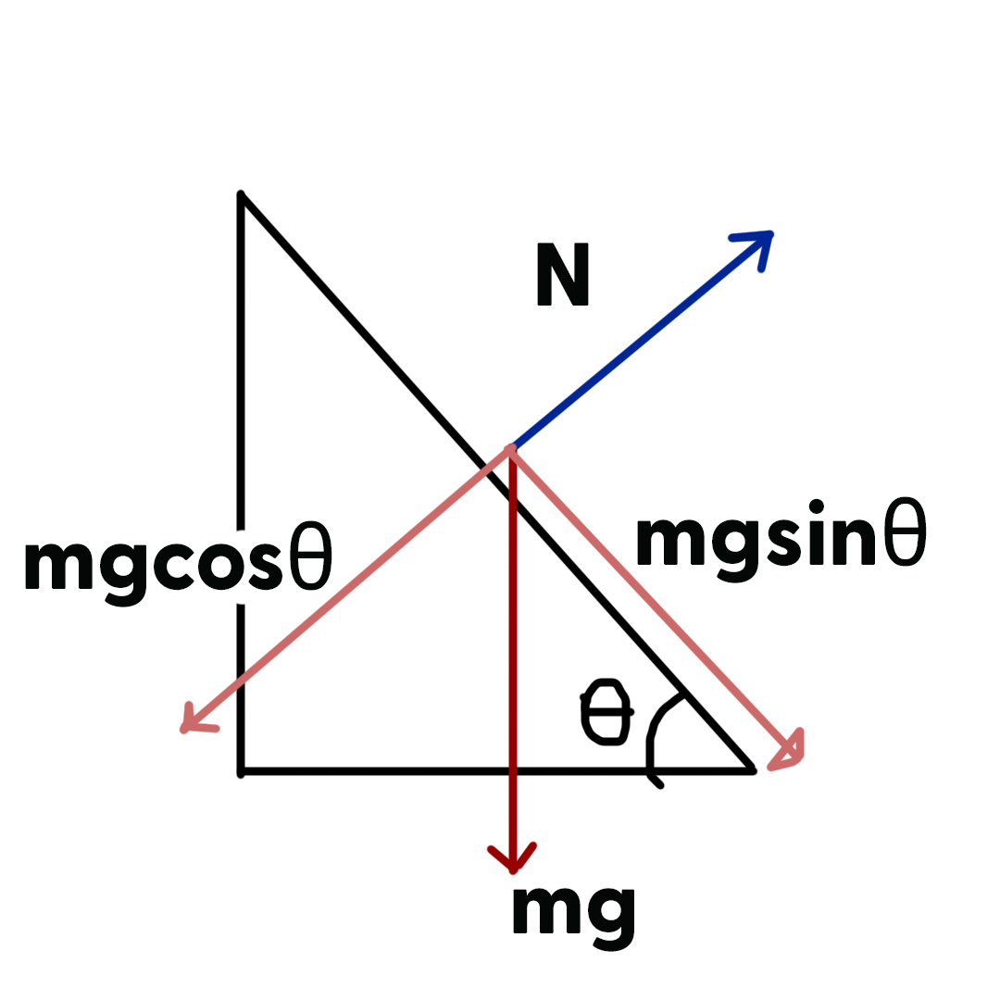

# SimulacaoFisicaBasica

### Autor: Gabriel Coutinho Chaves  
**nUSP:** 15111760  
**Email:** gabriel.coutinho.chaves@usp.br  

## Descrição Básica do Projeto
Este projeto é uma simulação interativa criada para explorar os conceitos de movimento em curvas e planos inclinados, sob a influência de forças como gravidade e atrito. O objetivo é oferecer uma representação visual que permita entender o comportamento de um corpo deslizando ao longo de uma superfície curva, que no projeto em questão foi definida por uma Curva de Bézier de controle ajustável.

O projeto consiste em simular a interação entre um corpo de teste, representado figurativamente pelo personagem Sonic, e uma curva de Bézier ajustável. O corpo de teste pode deslizar sobre a curva, estando também sujeito à força de atrito. Durante a execução do programa, é possível ajustar os parâmetros das forças e interagir diretamente com o corpo de teste, alterando sua posição ao arrastá-lo com o mouse. Além disso, o programa conta com um botão de reset que reposiciona o corpo de teste para a sua posição inicial.

<p align="center">
  <br>
  
  <br>
</p>

## Como Usar

### Instalação e Dependências

**Clone o repositório**  
-Certifique-se de ter o Git instalado no seu sistema. Em seguida, execute os comandos abaixo para clonar o repositório do projeto e navegar até o diretório clonado:

   ```bash
   git clone https://github.com/gabrielcoout/SimulacaoFisicaBasica.git
   cd SimulacaoFisicaBasica
```

Certifique-se de que o Python está instalado e verifique se você possui o Python na versão 3.6 ou superior. Caso contrário, faça o download e instale-o a partir do site oficial do Python.

- Instale as dependências
<br>
O repositório contém um arquivo requirements.txt, que lista os pacotes necessários para executar o projeto. Para instalar as dependências, execute o seguinte comando:

```bash
Copiar código
pip install -r requirements.txt
```

Para rodar a simulação básica, navegue até o diretório clonado e utilize o seguinte comando no terminal:
```bash
  python main.py
```

## Metodologia

Ao realizar do projeto, foi definida uma sequência de passos ordenados para a construção da simulação e do código. Foram as etapas definidas:
1. **Criação das classes e modularização do código:** Organização em módulos bem definidos para maior clareza e reutilização.
2. **Estabelecimento de um sistema métrico e de unidades:** Conversão de grandezas físicas para valores compatíveis com a simulação.
3. **Definição de constantes:** Determinação de valores ou intervalos para as constantes físicas relevantes.
4. **Simulação das forças:** Implementação de ações e resultados de forças como gravidade e atrito.


Ademais, foram estabelecidos objetivos para simulação, isto é, definiu-se alguns resultados que se desejou visualizar na execução do projeto, a fim de atestar sua qualidade. Foram eles:
- Visualizar que, na ausência de forças, o objeto mantêm seu vetor velocidade constante. Em particular, buscou-se notar o efeitos da ausência de gravidade.
- Visualizar que, na ausência de atrito, a energia se conserva.
- Visualizar que existe um valor no qual o atrito cancela à aceleração da gravidade.
- Notar que, ao chegar em pontos criticos, a velocidade se anula.

## Modularização do código

A estrutura do código utiliza **pygame** para a interface gráfica e **numpy** para cálculos matemáticos e vetoriais. A organização segue o paradigma de orientação a objetos, com a seguinte divisão:


- **`config.py`**: Configurações gerais do programa, como parâmetros de tela e constantes.
- **`slider.py`**: Implementação de sliders para ajuste dinâmico de parâmetros.
- **`bezier_curve.py`**: Classe responsável pela construção e manipulação da curva de Bézier.
- **`ball.py`**: Classe que representa o corpo de teste, com atributos e métodos relacionados ao movimento.
- **`main.py`**: Arquivo principal que integra e executa a simulação.

Além disso, as imagens necessárias para o programa estão armazenadas na pasta **`img`**.


## Definição das Unidades de Medida

A primeira etapa foi estabelecer coerência entre as constantes físicas reais e as utilizadas na simulação. A resolução da tela foi fixada em **800x600 pixels**, e a conversão entre pixels e metros foi baseada no tempo necessário para uma partícula percorrer a altura da tela sob gravidade.

### Cálculo da Proporção Metro-Pixel
Adotou-se um intervalo de $1,5$ segundos para que a partícula, acelerada pela gravidade terrestre ($g = 9,81 \, m/s^2$), percorresse a altura da tela. Com base na equação do movimento uniformemente acelerado:

$$
s = \frac{1}{2} g t^2 \implies s = \frac{1}{2} (9,81) (1,5)^2 = 11,025 \, \text{m}
$$

Assim, o tamanho da tela em metros quadrados é de $11,025 \times14,70\text{m}^2$, e a proporção metro-pixel é calculada como:

$$
\text{Razão:} \quad \frac{600 \, \text{pixels}}{11,025 \, \text{m}} = 54,42 \, \text{pixels/m}
$$

### Conversão das Constantes Físicas
Com essa proporção, as constantes físicas reais foram convertidas para unidades compatíveis com a simulação. Por exemplo, a aceleração da gravidade em pixels foi obtida como:

$$
g_{\text{simulação}} = 9,81 \, \text{m/s}^2 \times 54,42 \, \text{pixels/m} = 533,33 \, \text{pixels/s}^2
$$

### Orientação da simulação

Optou-se por manter a orientação padrão do `pygame`, em que a origem é associada com o vértce superior direito da tela, que pode ser descrito pelo 1º quadrante do espaço gerado pela compiação linear dos vetores [0,1],[0,-1] no sistema de coordenadas usuais. Isso implica, entre outras coisas, que a força da gravidade será um vetor orientado em direção vertical positiva, no código, embora a representação visual não seja afetada. 

## Curvas de Bezier

Curvas de Bézier são um tipo de curva paramétrica amplamente utilizada em computação gráfica e áreas correlatas. Ela é definida por um conjunto de pontos de controle discretos que, por meio de uma fórmula matemática, determinam uma curva suave e contínua. Em gráficos vetoriais, as curvas de Bézier são essenciais para modelar curvas suaves e escaláveis infinitamente, garantindo precisão e flexibilidade no design.

Decidiu-se por implementar esse tipo de curva para poder visualizar uma quantidade maior de cenários, de modo a enriquecer a simulação e jogar luz sobre mais aspectos físicos do sitema o qual se desejou modelar. A implementação dessas curvas foi feita com auxílio da LLM (Large Language Model) Open AI ChatGPT.  

A classe **`BezierCurve`** foi projetada para modelar, analisar e possibilitar a interação com uma curva de Bézier, permitindo sua manipulação visual e o cálculo de propriedades geométricas. A instanciação da classe recebe, principalemente, os pontos de controle, pares ordenados (x,y), na quantidade que for fixada no código. É, então, cálculada a posição de um ponto na curva para um parâmetro $t$ utilizando o **algoritmo de De Casteljau**. A posição do ponto é definida pela fórmula:

$$
P(t) = \sum_{i=0}^{n} \binom{n}{i} (1 - t)^{n-i} t^i P_i
$$

Aqui, $P_i$ representa os pontos de controle da curva e $n$ é o número total de pontos menos um. Esse método fornece uma forma precisa de obter posições ao longo da curva para qualquer valor de $t \in [0, 1]$. A curva, como objeto do programa, é um conjunto enumerável de pontos, de número fixado, que são gerados a partir dos pontos de controle. Para sa simulação, utilizaram-se 1000 pontos. A natureza discreta da curva acarreta em imprecisões na simulação que serão discutidas ao longo do texto. 

É importante ressaltar que a classe também implementa o cálculo da reta tangente de um ponto da curva, que será importante para descrever o movimento do corpo de teste sob a curva. O cálculo da tangente é feito da seguinte forma: 

$$
T(t) = n \sum_{i=0}^{n-1} \binom{n-1}{i} (1 - t)^{n-1-i} t^i (P_{i+1} - P_i)
$$

A derivada de $P(t)$. Esse vetor é essencial para determinar a direção do movimento ao longo da curva e para calcular ângulos relativos. Nesse contexto, também foi implementado o método **`closest_point_and_tangent`** encontra o ponto da curva mais próximo de uma coordenada e retorna o vetor tangente associado.

## Classe `Ball`

A classe **`Ball`** é a principal classe do programa e modela uma bola interativa em um ambiente 2D, incluindo simulação física e animações, permitindo interações como arrastar, rolar e deslizamento em curvas. Seus atributos são: 

- **`pos`**: Vetor 2D para posição da bola $$(x, y)$$.
- **`velocity`**: Vetor 2D para velocidade da bola $$(v_x, v_y)$$.
- **`acceleration`**: Vetor 2D para aceleração da bola $$(a_x, a_y)$$.
- **`radius`**: Raio da bola.
- **`color`**: Cor da bola no formato RGB.
- **`animations`**: 
  - Levantada.
  - Rolando.
  - Estacionária.

Os métodos principais da classe ``Ball`` proporcionam funcionalidades essenciais para simulação física e interatividade. O método ``draw`` é responsável por renderizar a bola na tela, alternando entre animações como elevação, rolamento ou estado estacionário, dependendo da situação. Já o método ``handle_event`` gerencia a interação do usuário, permitindo que a bola seja arrastada ou redefinida por meio de cliques no botão de ``reset``. Para representar a dinâmica, o método ``draw_velocity`` desenha o vetor de velocidade da bola como uma seta na tela, exibindo sua magnitude em metros por segundo (vale ressaltar que a seta exibida não está na escala da tela para facilitar sua visualização, sua escala é 0.25). O método draw_time mostra o tempo total desde que a bola foi solta. Finalmente, o método reset redefine a posição e velocidade da bola para os valores iniciais. A bola é influenciada por propriedades físicas como gravidade e atrito, que atuam de forma realista em interação com a curva de Bézier, enquanto animações específicas, como ``lifted.png``, ``roll*.png`` e ``steady*.png``, tornam a experiência visual mais dinâmica e possibilitam visualizar certos padrões de comportamento do corpo de teste. 

Finalmente, o método ``update`` é o principal da simulação por atualizar a posição e a velocidade da bola, considerando a gravidade, o atrito e o contato com a curva de Bézier, além de ajustar sua posição para evitar interseções incorretas. Esse método será mais detalhado na seção seguinte

# Modelo Físico

A ideia geral da simulação é considerar que cada trecho suficientemente pequeno da curva funciona como um plano inclinado. Assim, foi utilizado o método `closest_point_and_tangent` para obter o vetor tangente do ponto mais próximo do corpo de teste. Assim, obtém se a inclinação calculando o *arcotangente* do vetor tangente, obtendo o ângulo de inclinação. A partir dao, faz-se a decomposição das forças segundo o diagrama:

<p align="center">
  <br>
  
  <br>
</p>

Assim, o programa detecta se há colisão com a curva calculando a distância entre a bola e o ponto mais próximo na curva, em seguida é feito teste se essa distância menos o raio da curva é aproximadamente nula. Caso sim, há colisão e passa-se para a etapa de modelar essa colisão.

Quando a distância entre a posição da bola e o ponto mais próximo na curva de Bézier é menor ou igual ao raio da bola, isso indica que houve uma interseção, ou seja, a bola está "invadindo" a curva. Para corrigir essa sobreposição, calcula-se o valor do `overlap` (sobreposição) como a diferença entre o raio da bola e a distância encontrada: A posição da bola é então ajustada deslocando-a ao longo do vetor normal (que aponta da curva para a posição da bola) pelo valor calculado do `overlap`. Esse ajuste é realizado pela fórmula: Esse processo garante que a bola fique exatamente no limite da curva, sem interseção, mantendo a simulação física consistente.

Com o ângulo obtido a partir da tangente, é fácil obter o seno e o cosseno da inclinação, possibilitando fazer as projeções das forças. 

Definindo um eixo de coordenadas associado com a inclinação da curva onde, $\vec{i}$ é a direção do vetor tangente (o versor tangente), que chamaremos de x', e $\vec{j}$ é o vetor normal ao movimento (o vetor perpendicular à tangente, que chamaremos y'. Assim, considerando as forças da gravidade e normal, obtém-se as seguintes equações diferenciais ordinárias:

$$m\frac{dy'}{dt} = mg\cos(\theta) - N $$ 

$$m\frac{dx'}{dt} = mg\sin{\theta} $$ 

Como o movimento no eixo $\vec{j}$ é modelado como nulo, uma vez que o objeto não entra dentro da curva, o movimento é definido para acontecer na direção tangente. Como pode-se observar, optou-se no modelo por anular o vetor não colocar a força de atrito nessa descrição das forças. Uma vez que sabe-se que o atrito é uma força dissipativa proporcional à velocidade, decidiu-se só modelar a sua proporcionalidade com a velocidade. Com efeito, o resultado do sistema, obtém-se:

$$N = mg\cos(\theta) $$ 

$$\frac{dx'}{dt} := a_{tangente} = g\sin(\theta) \iff v_{tangente} = v_{0_{tangente}} + g\sin{\theta}$$ 

como $v_x = v_{tangente} \sin{\theta}$ e $v_x = v_{tangente} \cos{\theta}$ então, obtém-se: 

$$a_x = g (\cos{\theta}\sin{\theta})$$
$$a_y = g(\sin^2(\theta))$$

A partir desses resultados, incrementa-se (integra) a velocidade em intervalos pequenos de tempo `dt`, o passo do método definido como pygame.clock.tick(FPS=60)/0.001, da seguinte forma:
```
self.aceleration[1] = GRAVITY * (sin_theta**2) 
self.aceleration[0] = GRAVITY * (sin_theta * cos_theta) 
self.velocity += self.aceleration * dt
```

Quando Fora da Curva, apenas a gravidade afeta a aceleração:

$$
\text{self.aceleration} = [0, g]
$$

Considerando o fato que o atrito é proporcional â velocidade, implementou-se ele da seguinte maneira: 

```
self.velocity *= (1-FRICTION)
```

Tanto no caso em que há contato com a curva quanto em queda livre, a atualização da posição a posição da bola é atualizada com base na velocidade:

$$
\text{self.pos} += \text{self.velocity} \cdot dt
$$


## Conclusão

Com esse projeto simples é possível visualizar alguns fenômenos da cinemática básica, como a ação de forças conservativas e a forma com que o vetor velocidade se altera ao longo de uma trajetória. No entando identificou-se que a discretização do modelo ao incrementar diferenças `dt` muito grandes comprometeu alguns resultados esperados, como a perfeita conservação de energia. Como próximos passos, poderia-se propor a utilização de outros métodos para integrar numericamente a velocidade e a posição. 

## Referência

- WIKIPEDIA. Bézier curve. Disponível em: https://en.wikipedia.org/wiki/B%C3%A9zier_curve. Acesso em: 04 dez. 2024.
- PYGAME. Pygame Documentation. Disponível em: https://www.pygame.org/docs/. Acesso em: 04 dez. 2024.
- NUMPY. NumPy Documentation. Disponível em: https://numpy.org/doc/. Acesso em: 04 dez. 2024.
